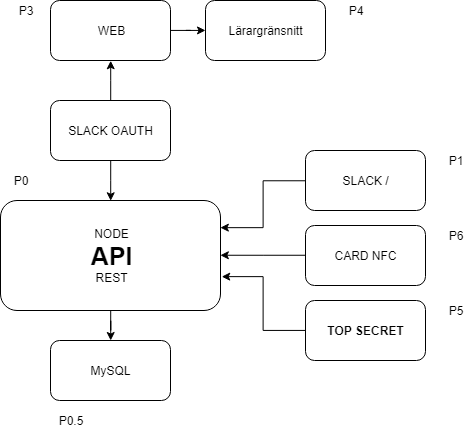

# Tidsapp av Happy Surfers

## Websites

Production branch - https://chk.ygstr.com (Webhooked)

Dev branch - https://dev.chk.ygstr.com (Webhooked)

## Installtion

### Prerequisites

* NodeJS
* MySQL

### Setup database, config and node server

1. Import the database `mysql -u username -p < database.sql`
2. Install all NPM dependencies `npm i`
3. Start it and then stop it `sudo node index.js`
4. Configure mysql and web-port `config.json`
5. Run tests and make sure everything checks out ```npm test```

## Tests

Run tests with the command ```npm test```

All tests are located in ```/test/test.js```.

## Sructure

All webpages (except docs) is written in PUG, they are found in ```/views```

```/press``` is for images, source psd/ai or concept-art that is not displayed on the website. This can also be logo guides. 

Tests are located in ```/test/test.js```


## Resources

Wiki docs https://github.com/te4umea2019/Tidsapp-HS/wiki

Trello board https://trello.com/b/hxbEuuSt/chkm8

## Diagram



## MySQL tables

**Important: When storing the date, store it in ms since epoch, ```Date.now()```**

#### Users
name | type | special | description
--- | --- | --- | ---
id | INT | AUTO_INCREMENT, PRI | ID of the user
username | VARCHAR |NULL | User choosen name
name | VARCHAR | NULL | Full name of the user
password | VARCHAR | NULL | 
created | TIMESTAMP | CURRENT_TIMESTAMP | The date the user was created
admin | TINYINT | NULL | Boolean(0-1) if the user is an admin or not.
email | VARCHAR | NULL | Email of the user
avatar | VARCHAR | NULL | Link of the username
access_token | VARCHAR | NULL | Access token given by slack, used to update user information
slack_id | VARCHAR | NULL | 
slack_domain | TINYTEXT | No default | 


#### Checks
name | type | special | description
--- | --- | --- | ---
id | INT | AUTO_INCREMENT, PRI | ID of the check
user | INT | No default | ID of the user
check_in | TINYINT | No default | Boolean(0-1) if the it was a check in (otherwise check out)
project | INT | NULL | Name of the project
date | TIMESTAMP | CURRENT_TIMESTAMP | Date of the project
type | INT | NULL | Check in type (web, card, TOP SECRET)


#### Tokens

name | type | special | description
--- | --- | --- | ---
id | INT | AUTO_INCREMENT, PRI | ID of the token
user | INT | No default | ID of the user
created | TIMESTAMP | CURRENT_TIMESTAMP | 
ip | VARCHAR | No default | 
token | VARCHAR | No default | Token

#### Projects

name | type | special | description
--- | --- | --- | ---
id | INT | AUTO_INCREMENT, PRI | ID of the project
name | TEXT | No default | Name of the project
created | TIMESTAMP | CURRENT_TIMESTAMP | 
owner | INT | NULL | 
color_top | TEXT | No default | 
color_bot | TEXT | No default | 

#### Joints (table name subject to change ??)
List of who has joined what team and how much work they have done (in hours / minutes)

name | type | special | description
--- | --- | --- | ---
id | INT | AUTO_INCREMENT, PRI | ID of the joint
project | INT | NULL | Name of the project
user | INT | NULL | ID of the user
work | BIGINT | NULL | Work done in ms (1 hour of work = 3600000)
date | TIMESTAMP | CURRENT_TIMESTAMP | Date of joining the project
